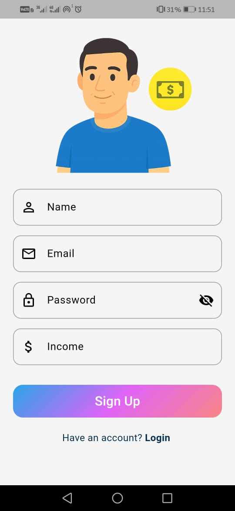
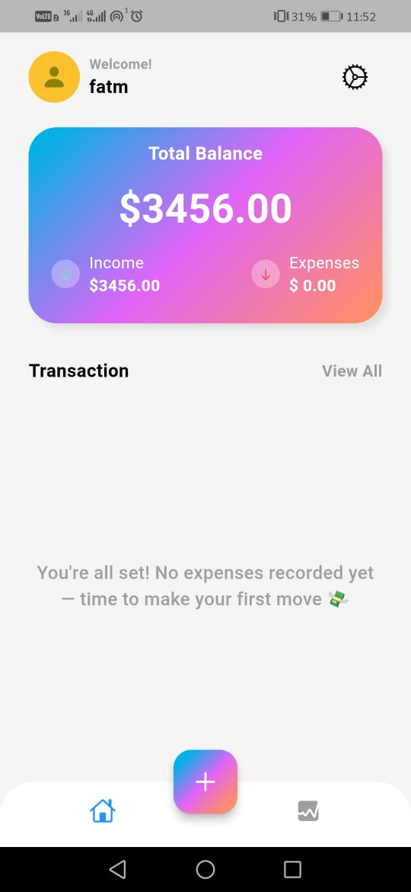

# 💰 MoneyNest

**Your Smart Personal Expense Tracker**

MoneyNest is a beautifully designed app to help you take control of your daily expenses, income, and financial habits. Powered by Firebase and built using Clean Architecture & BLoC pattern with Flutter.

---

## ✨ Features

- 🔐 Secure sign-up and login with Firebase Authentication
- 📊 Visualize your income and expenses with dynamic charts
- 💸 Add and delete expenses with category tracking
- 📁 View total balance and transaction history
- 🌈 Elegant and colorful UI inspired by modern design
- 🔔 Custom Snackbar alerts and error handling

---

## 📸 Screenshots

  
  

---

## 🔧 Technologies Used

- **Flutter** (Clean Architecture + BLoC)
- **Firebase Authentication**
- **Firebase Firestore**
- **fl_chart** for dynamic charts
- **Custom Snackbar** for feedback

