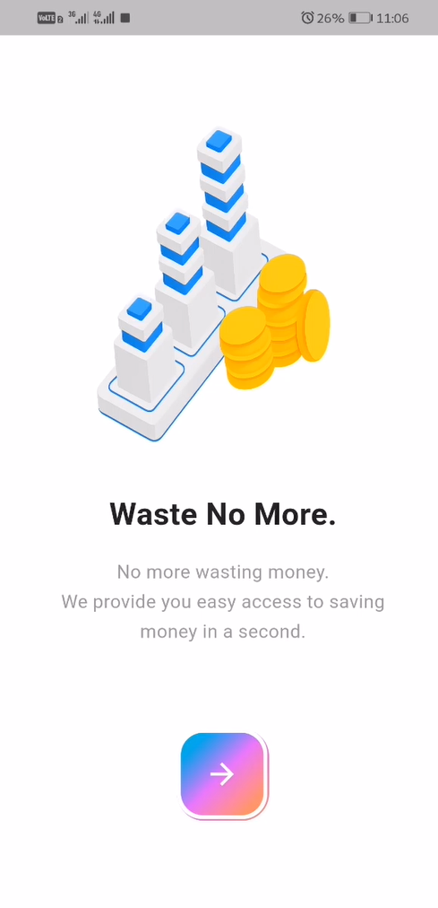
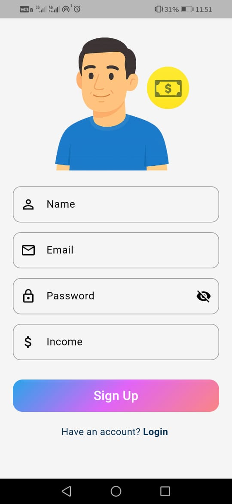
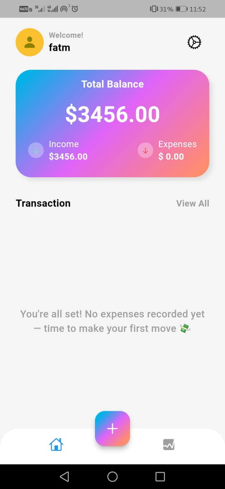
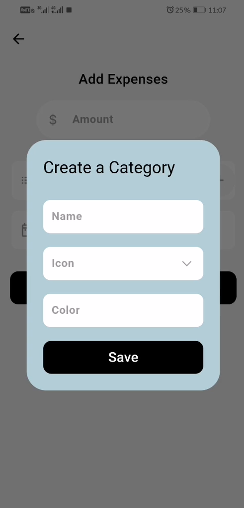
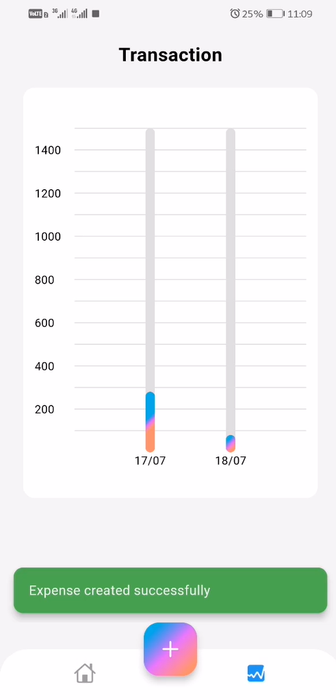
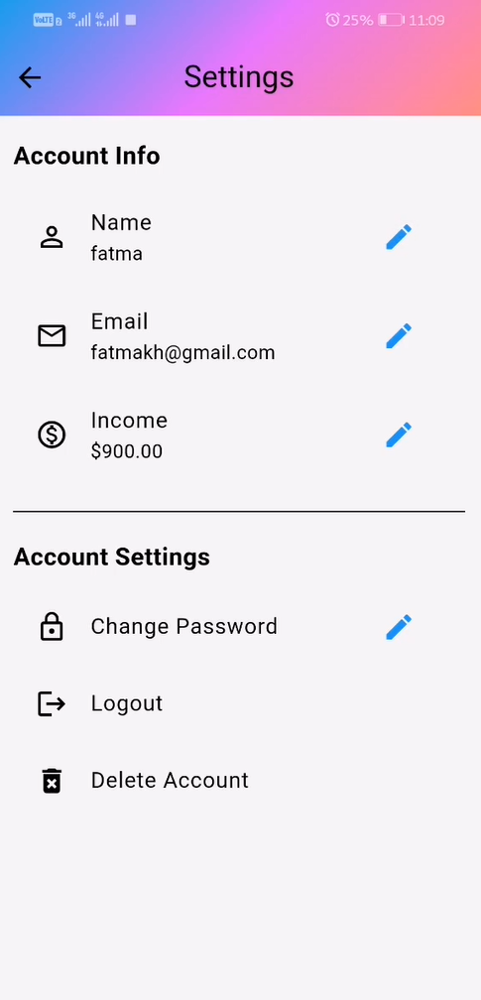

# 💰 MoneyNest

**Your Smart Personal Expense Tracker**

MoneyNest is a beautifully designed Flutter app that helps you take control of your daily expenses, income, and financial habits.  
Built with **Clean Architecture** and the **BLoC pattern**, and powered by **Firebase** for secure authentication and real-time data management.

---

## ✨ Features

- 🔐 Secure sign-up and login with Firebase Authentication  
- 📊 Visualize your income and expenses with dynamic charts  
- 💸 Add, edit, and delete expenses with category tracking  
- 📁 View total balance and full transaction history  
- 🌈 Elegant and modern UI design  
- 🔔 Custom Snackbar alerts and robust error handling  

---

## 📸 Screenshots

<p align="center">
  
  
  
  
</p>

<p align="center">
  
  
  
</p>
---

## 🛠 Technologies Used

| Technology | Purpose |
|------------|--------|
| Flutter | Cross-platform development |
| BLoC & Clean Architecture | State management & scalable architecture |
| Firebase Authentication | Secure user authentication |
| Firebase Firestore | Real-time database |
| fl_chart | Dynamic charts for income & expenses |
| Custom Snackbar | Feedback and alerts |

---

## 📂 Project Structure

```text
lib
 ┣ core
 ┃ ┗ utils
 ┃    ┣ functions          # Reusable helper functions (validators, formatters, etc.)
 ┃    ┗ widgets            # Reusable widgets (CustomButtons, Snackbars, Charts, etc.)
 ┣ features
 ┃ ┣ splash                # Splash screen feature
 ┃ ┣ home                  # Home screen feature
 ┃ ┣ authentication        # Sign-up / Login / Logout
 ┃ ┗ expenses
 ┃    ┣ data               # Models, repositories, data sources
 ┃    ┣ domain             # Entities, use cases
 ┃    ┗ presentation       # Screens, blocs, feature-specific widgets
 ┣ main.dart               # App entry point
```

The project follows **Clean Architecture principles** to maintain a modular and scalable codebase.

---

## 🚀 Getting Started

### 1️⃣ Clone the repository

```bash
git clone https://github.com/Fatma-kabil/MoneyNest
```

### 2️⃣ Navigate to the project directory

```bash
cd moneynest
```

### 3️⃣ Install dependencies

```bash
flutter pub get
```

### 4️⃣ Run the application

```bash
flutter run
```

---

## 🎯 Project Goals

MoneyNest was built to:

- Help users track expenses and income easily  
- Visualize financial habits through charts  
- Implement **Clean Architecture** with **BLoC** in a real-world Flutter app  
- Integrate secure authentication and real-time database with Firebase  

---
